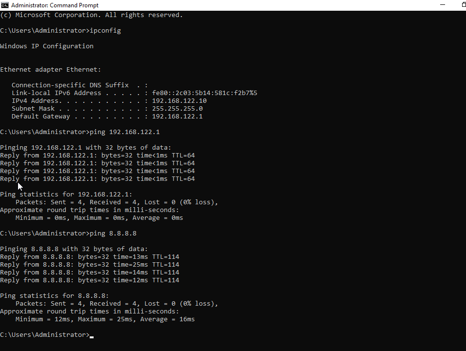

# Lab 01 – Windows Server Installation & Network Configuration
## Static IP Configuration

Configured DC01 with a static IPv4 address before installing Active Directory Domain Services.

- Computer name: DC01
- IPv4 address: 192.168.122.10
- Subnet mask: 255.255.255.0
- Default gateway: 192.168.122.1
- Preferred DNS server: 192.168.122.10

A static address was assigned because domain clients must be able to reliably locate the domain controller and DNS services.

## Network Connectivity Testing

After assigning the static IPv4 configuration, connectivity was verified from Command Prompt.

### Tests performed

- `ipconfig` confirmed the server address was `192.168.122.10`
- `ping 192.168.122.1` verified communication with the default gateway
- `ping 8.8.8.8` verified external internet connectivity by IP address

Both ping tests returned four successful replies with 0% packet loss.

### DNS Resolution Test

The command `ping google.com` failed with:

`Ping request could not find host google.com`

Since `ping 8.8.8.8` succeeded, internet routing was working. The failure indicated that DNS name resolution was unavailable because DC01 was configured to use itself as the preferred DNS server before the DNS Server role had been installed.
