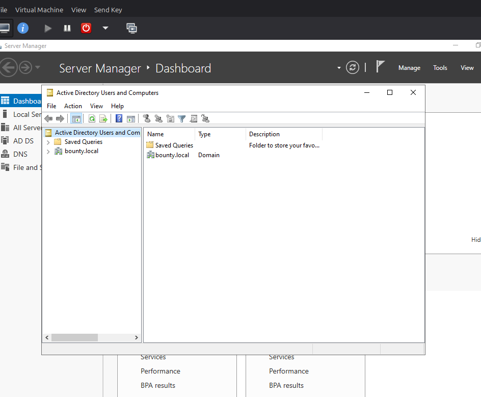
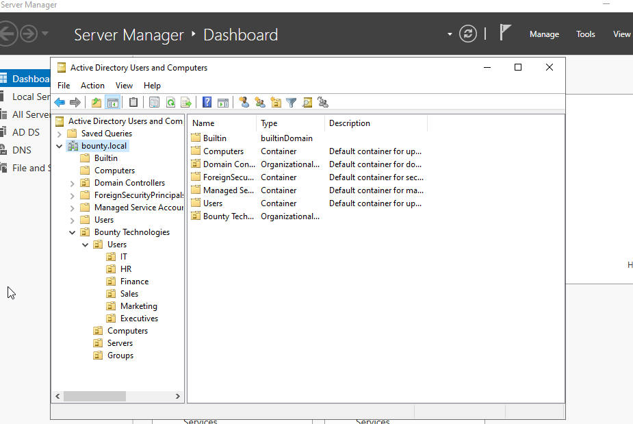

# Lab 03 – Organizational Units (OU) Design

## Objective

Design an Active Directory Organizational Unit (OU) structure for a fictional company named Bounty Technologies.

## Why Organizational Units?

Organizational Units provide a logical way to organize users, computers, servers, and groups within Active Directory.

Benefits include:

- Easier administration
- Reduced repetitive management tasks
- Easier user and computer location
- Support for Group Policy deployment
- Scalability as the organization grows

## Company Structure

Bounty Technologies

Users
- IT
- HR
- Finance
- Sales
- Marketing
- Executives

Computers

Servers

Groups

## Design Decision

The environment was organized using a company-level Organizational Unit.

If additional office locations are added in the future, the design can be expanded to:

San Antonio
Dallas
Austin

Each office can contain its own departmental Organizational Units while allowing policies to be applied at either the office or department level.

## Skills Practiced

- Active Directory Users and Computers
- Organizational Unit creation
- Enterprise directory design
- Active Directory hierarchy planning
- Preparing for Group Policy implementation

## Outcome

Successfully created a scalable Organizational Unit structure that resembles a real enterprise Active Directory environment.

## Screenshots

