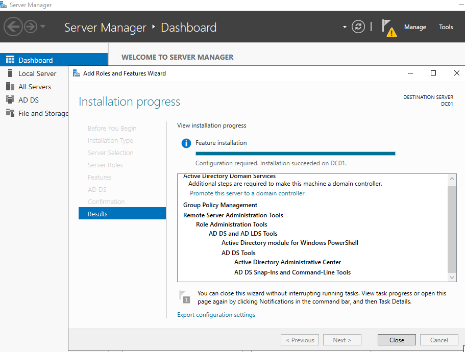
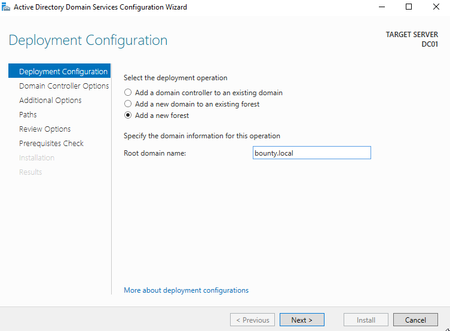
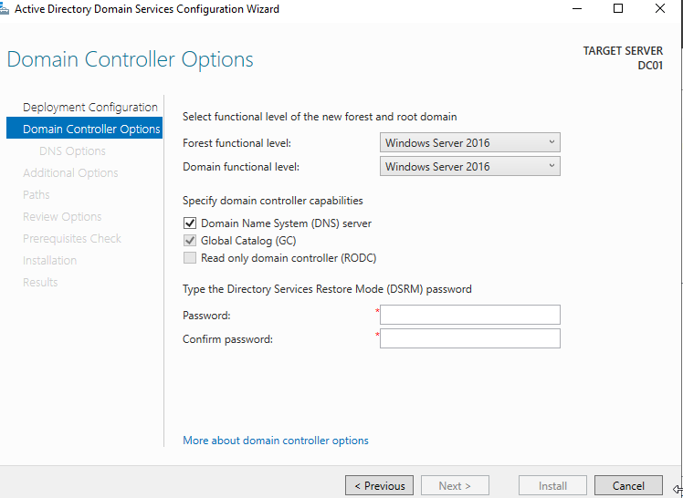
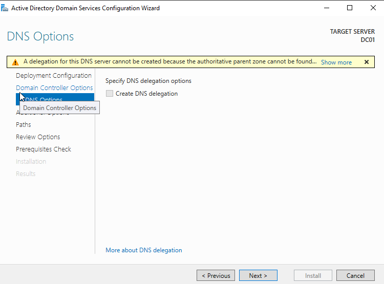
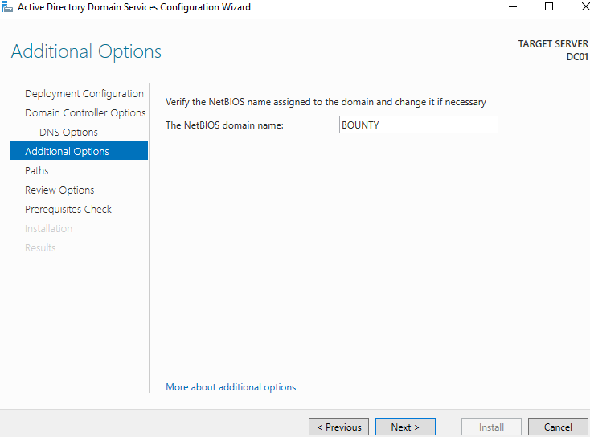
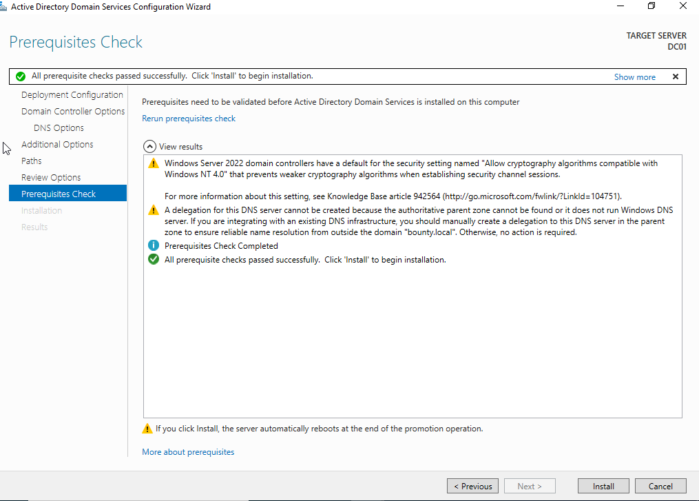
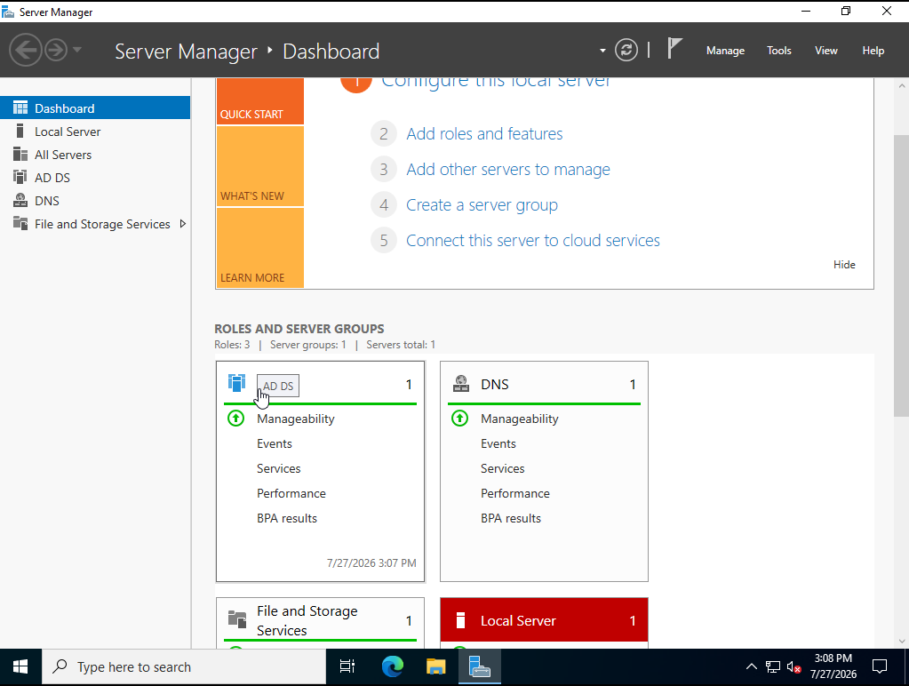

# Lab 02 — Active Directory Domain Services

## Objective

Install Active Directory Domain Services on Windows Server 2022, promote the server to a domain controller, and create a new Active Directory forest and domain.

## Environment

- Hypervisor: KVM/QEMU with virt-manager
- Server operating system: Windows Server 2022
- Server name: DC01
- Static IPv4 address: 192.168.122.10
- Subnet mask: 255.255.255.0
- Default gateway: 192.168.122.1
- Domain name: bounty.local
- NetBIOS domain name: BOUNTY

## Active Directory Role Installation

Installed the Active Directory Domain Services role through Server Manager using the Add Roles and Features Wizard.

The required management tools and supporting features were added automatically.

## Domain Controller Promotion

Promoted DC01 as the first domain controller in a new forest.

Configuration used:

- Deployment type: Add a new forest
- Root domain name: bounty.local
- Forest functional level: Windows Server 2016
- Domain functional level: Windows Server 2016
- DNS Server: Enabled
- Global Catalog: Enabled
- Read-Only Domain Controller: Disabled
- NetBIOS domain name: BOUNTY

A Directory Services Restore Mode password was also configured for Active Directory recovery.

## DNS Delegation Warning

The promotion wizard displayed a warning that DNS delegation could not be created because an authoritative parent zone could not be found.

This was expected because bounty.local is a new, private Active Directory forest and does not have an existing parent DNS infrastructure.

## Prerequisite Validation

The prerequisite check completed successfully.

The remaining warnings were informational and did not prevent installation.

## Verification

After the server restarted, Server Manager displayed both:

- Active Directory Domain Services
- DNS Server

Both roles showed successful manageability status, confirming that DC01 had been promoted successfully and was functioning as a domain controller.

## Result

DC01 is now the first domain controller and DNS server for the bounty.local domain.

## Screenshots

